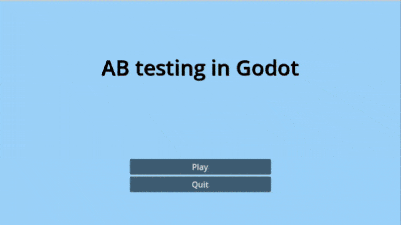

# How to implement A/B tests in GODOT

This is a 2D game created with the [Godot](https://godotengine.org/) game engine, demonstrating the implementation of A/B tests using [ConfigCat](https://configcat.com/) for feature flag management and [Amplitude](https://amplitude.com/) for analytics. 

The game features two distinct chest collecting variants based on the feature flag value:

- Variant A: Players must stand in front of the chest for 4 seconds to collect it.
- Variant B: Players must stand in front of the chest and press the 'Q' key three times to collect it.

Once the collection is successfully performed, the event is logged to Amplitude.

## Requirements

To run the project, ensure you have the following:

- your GPU drivers are up to date.
- [.NET6 or higher](https://dotnet.microsoft.com/en-us/download/dotnet/6.0)
- [Godot v4.0.3](https://downloads.tuxfamily.org/godotengine/4.0.3/) engine with .NET and Mono support.
- [ConfigCat account](https://app.configcat.com/) for feature flag management.
- [Amplitude account](https://analytics.amplitude.com/login) for analytics.

## Build & Run

1. Clone this repository to your local machine.

2. Open the `project.godot` file using the Godot importer.

3. Locate the `AmplitudeAnalytics.cs` and `ConfigCatService.cs` files in the `/globals` folder. Open these files with your code editor and replace the placeholder keys with your own keys.

4. In the `ConfigCatService.cs` make sure to match the flag name exactly as it set in ConfigCat's dashboard.

4. Return to the game engine and click the `Play` button to run the game.

5. Collect the chests in the game to generate Amplitude data.

6. Create a chart on Amplitude and add the `OnTap Chests Collected` and `OnTimer Chests Collected` events to analyze the results.

## Learn more

- [Learn Godot](https://docs.godotengine.org/en/stable/getting_started/step_by_step/index.html)
- [Learn C#](https://learn.microsoft.com/en-us/dotnet/csharp/tour-of-csharp/tutorials/)
- [ConfigCat .NET SDK Reference](https://configcat.com/docs/sdk-reference/dotnet/)
- [Amplitude Documentation](https://www.docs.developers.amplitude.com/)

[**ConfigCat**](https://configcat.com) also supports many other frameworks and languages. Check out the full list of supported SDKs [here](https://configcat.com/docs/sdk-reference/overview/).

You can also explore other code samples for various languages, frameworks, and topics here in the [ConfigCat labs](https://github.com/configcat-labs) on GitHub.

Keep up with ConfigCat on [Twitter](https://twitter.com/configcat), [Facebook](https://www.facebook.com/configcat), [LinkedIn](https://www.linkedin.com/company/configcat/), and [GitHub](https://github.com/configcat).

## Author

[Emil Kovacevic](https://github.com/emilkovacevic)

## Contributions

Contributions are welcome!
